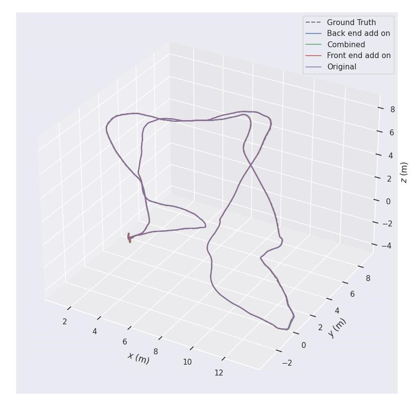
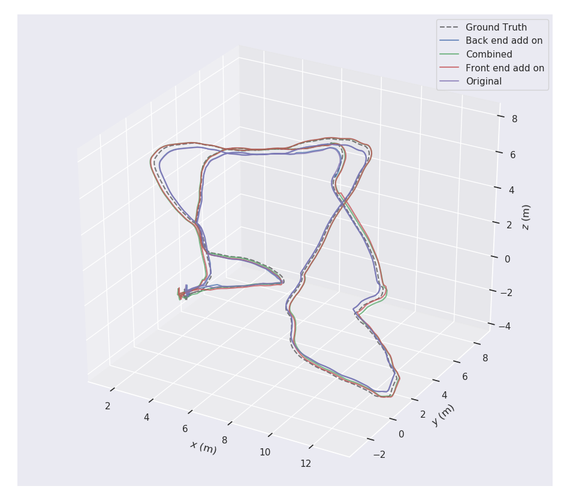
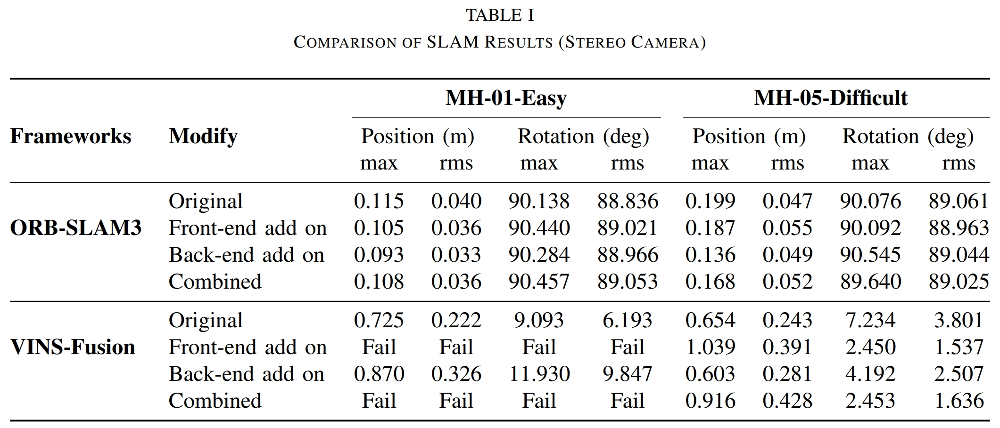
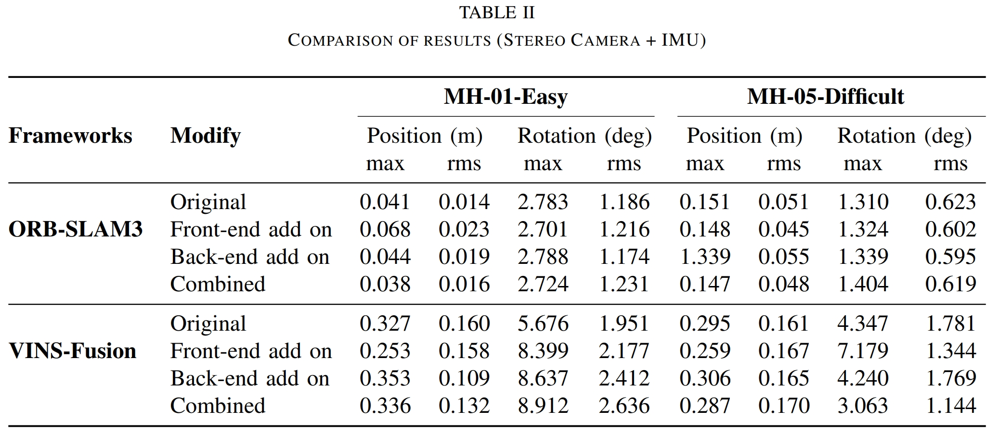

# Front-End and Back-End Optimization of ORB-SLAM3 and VINS-Fusion
This repo is for ROB 530 Final Project

Abstract: In this project, two typical SLAM algorithm, ORB-SLAM3 and VINS-Fusion are implemented and optimized basing on their structure. Optimization mainly including modifications and additions related to front-end and back-end structure of each method. At the end, the results of various optimization algorithm is compared with its original implementation, following its optimization performance analyzation basing on EuRoC dataset experiments.


Our modified ORB-SLAM3 and VINS-Fusion are included seperately in their own branches, specifically, [ORB-SLAM3-Modified](https://github.com/junhaotu2000/ROB-530-Final-Project/tree/ORB-SLAM3-Modified) and [VINS-Fusion-Modified](https://github.com/junhaotu2000/ROB-530-Final-Project/tree/VINS-Fusion-Modified).

You can setup each algorithm and test using [EuRoc](https://projects.asl.ethz.ch/datasets/doku.php?id=kmavvisualinertialdatasets), [KITTI](https://www.cvlibs.net/datasets/kitti/eval_odometry.php) and other open datasets. 

## Evaluation using [evo](https://github.com/MichaelGrupp/evo)
Install the evaluation software [evo](https://github.com/MichaelGrupp/evo)
```
sudo apt install python-pip 
pip install evo --upgrade --no-binary evo 
```
After installing the evaluation software, evaluate the absolute pose error.
```
evo_ape tum truth.txt before_filter.txt -p -va
evo_ape tum truth.txt after_filter.txt -p -va 
```
Generate the comparison for trajectory by 
```
evo_traj tum --ref=truth.txt before_filter.txt after_filter.txt -p -va --correct_scale -r trans_part/angle_deg
```
To compare the ASE(Absolute Pose Errors) of results before and after implementing bilateral filter. Make a new directory, evaluate the ASE of both results and save them as zip files in that directory 
```
mkdir results
evo_ape tum truth.txt before.txt -va --plot --plot_mode xyz --save_results results/before.zip
evo_ape tum truth.txt after.txt -va --plot --plot_mode xyz --save_results results/after.zip
```
Generate the ASE comparison plots by 
```
evo_res results/*.zip -p --save_table results/table.csv
```

## Results

Trajactory of modified ORB-SLAM3 and VINS-Fusion on EuRoC MH-05 dataset

### ORB-SLAM3


### VINS-Fusion



Error of postion and angle degree using ORB-SLAM3 and VINS-Fusion on EuRoC MH-01 and MH-05 datasets

### Stereo:


### Stereo & IMU:


## Reference:
1. Uz-SLAMLab, “GitHub - UZ-SLAMLab/ORB_SLAM3: ORB-SLAM3: an accurate Open-Source library for Visual, Visual-Inertial and Multi-Map SLAM,” GitHub. https://github.com/UZ-SLAMLab/ORB_SLAM3
2. Orsalmon, “GitHub - orsalmon/ORB_SLAM2_GTSAM: ORB-SLAM2 Library with an extension of GTSAM Factor Graph Streaming,” GitHub. https://github.com/orsalmon/ORB_SLAM2_GTSAM
3. OpenCV, “Open Source Computer Vision Library,” GitHub. https://github.com/opencv/opencv
